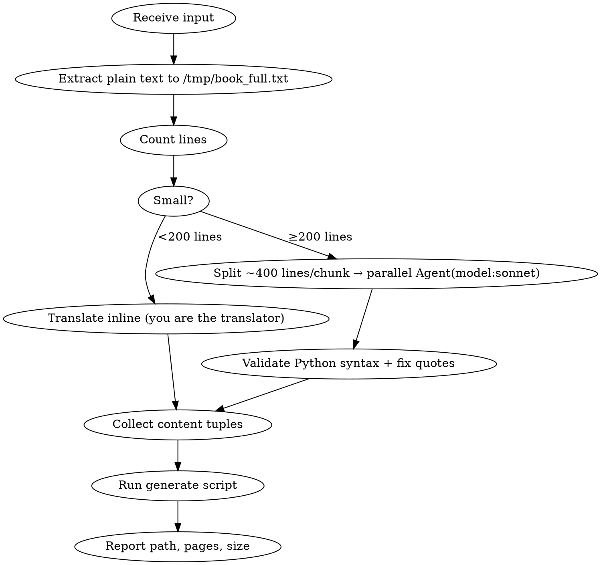

# Bilingual Book Generator

Convert English content into bilingual English-Chinese editions — one paragraph English, one paragraph Chinese. Output EPUB (for reading apps like WeChat Read) or PDF (with bookmarks).

## When to Use

- User provides an EPUB / URL / PDF / text and wants a bilingual version
- User says "双语", "bilingual", "英汉对照", "translate this book/article"

## Workflow



## Step 1: Extract

| Input | Command |
|-------|---------|
| `.epub` | `pandoc input.epub -t plain --wrap=none > /tmp/book_full.txt` |
| URL | WebFetch → save to `/tmp/book_full.txt` |
| `.pdf` | `python3 -c "import pdfplumber; ..."` or `pdftotext` |
| `.txt` | Read directly |

Then: `wc -l /tmp/book_full.txt` to decide strategy.

## Step 2: Translate (You ARE the translator)

Claude translates directly — no external API needed. For large content, dispatch parallel agents.

**Agent prompt (copy exactly, fill in START/END/N):**

```
Read /tmp/book_full.txt lines {START}-{END}.

Translate EVERY SINGLE PARAGRAPH into Chinese. Create /tmp/bilingual_part_{N}.py with variable content_part_{N}.

Format: list of tuples (type, english, chinese) where type is one of:
- 'part' for major section headers like "Part I: ..."
- 'chapter' for chapter/section headers
- 'highlight' for short punchy quotes (1-2 sentences max)
- 'question' for Q: lines
- 'text' for ALL other paragraphs

Rules:
- Include EVERY paragraph. Do not skip or combine any.
- Skip only blank lines and [] markers.
- Translate naturally into Chinese, not word-for-word.
- If Chinese text contains ASCII double quotes, escape as \" or use 「」.
```

**Agent dispatch rules:**
- Use `model: sonnet` for cost/speed
- ≤400 lines per chunk to avoid token limits
- After agents return, validate: `compile(open(f).read(), f, 'exec')`

## Step 3: Generate

After collecting all content tuples, run the generator script bundled with this skill.

**Install dependencies (once):**
```bash
pip install ebooklib reportlab
```

**Generate EPUB:**
```bash
python3 {SKILL_DIR}/generate.py epub \
  --content-files /tmp/bilingual_part_1.py,/tmp/bilingual_part_2.py \
  --title "Book Title" \
  --author "Author" \
  --output /path/to/output.epub
```

**Generate PDF:**
```bash
python3 {SKILL_DIR}/generate.py pdf \
  --content-files /tmp/bilingual_part_1.py,/tmp/bilingual_part_2.py \
  --title "Book Title" \
  --author "Author" \
  --output /path/to/output.pdf
```

`{SKILL_DIR}` is the directory containing this SKILL.md file.

## Content Types

| Type | Use for | Style |
|------|---------|-------|
| `part` | Part I, Part II... | Large centered, page break |
| `chapter` | Section headers | Colored heading |
| `highlight` | Short punchy quotes | Bold, accent color |
| `question` | Q&A questions | Italic |
| `text` | Everything else | Normal |

## Troubleshooting

| Issue | Fix |
|-------|-----|
| Agent token limit | Smaller chunks (≤300 lines) |
| `""` breaks Python | Escape `\"` or use `「」` |
| Missing paragraphs | Compare: `wc -l` vs entry count |
| No Chinese font (PDF) | `fc-list :lang=zh` to find system fonts |
